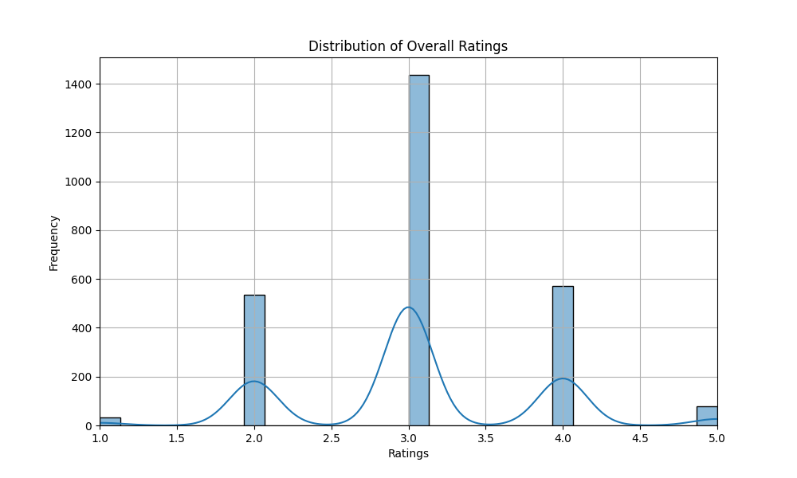
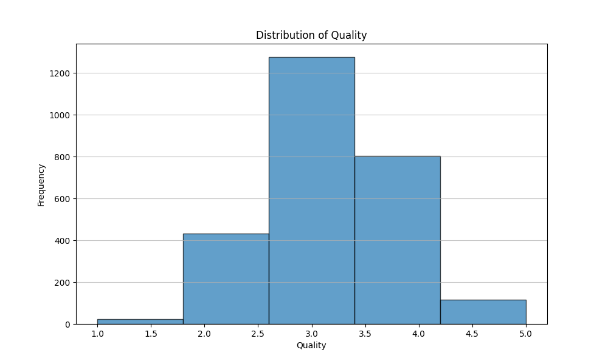

### Data Analysis Report

#### Introduction
This report analyzes a dataset encompassing reviews that include metrics on 'overall', 'quality', and 'repeatability'. Key statistics are provided for each of these metrics, along with visualizations that elucidate their distribution and potential patterns.

#### Data Overview
The dataset contains a total of 2,652 entries across the following key columns:
1. **Overall Rating**: 1 to 5
2. **Quality Rating**: 1 to 5
3. **Repeatability Rating**: 1 to 3

#### Statistical Summary
- **Overall Rating Details**:
  - Mean: 3.05
  - Standard Deviation: 0.76
  - Minimum: 1
  - Maximum: 5
  - 75th Percentile: 3

- **Quality Rating Details**:
  - Mean: 3.21
  - Standard Deviation: 0.80
  - Minimum: 1
  - Maximum: 5
  - 75th Percentile: 4

- **Repeatability Rating Details**:
  - Mean: 1.49
  - Standard Deviation: 0.60
  - Minimum: 1
  - Maximum: 3
  - 75th Percentile: 2

#### Insights Discovered
1. **Distribution Patterns**: From the datasets, it appears that both 'Overall' and 'Quality' ratings tend to cluster around the lower to mid-range values, with most ratings being either 3 or 4. This suggests a possible ceiling effect where few high scores (4 or 5) are awarded compared to the lower scores.
2. **Quality vs. Overall Ratings**: Notably, the mean quality rating (3.21) is slightly higher than the mean overall rating (3.05). This might indicate that while users appreciate the quality, the overall experience might be lacking due to other factors such as accessibility or customer service.
3. **Repeatability**: The repeatability metric shows that a significant number of entries score at the minimum value of 1, pointing towards potential issues in the assurance of repeat experiences or satisfaction levels for the users.
4. **Outliers**: The maximum values of 'Overall' and 'Quality' ratings (both 5) are isolated; there could be outlier experiences that are worth investigating further to understand what drives high satisfaction.

#### Implications of Findings
- **Enhancing Overall Experience**: Given that the overall ratings do not match the slightly higher quality ratings, there may be opportunities to improve the overall user experience. Initiatives to address common user complaints should be explored based on qualitative feedback.
- **Repeatability Improvement**: With low repeatability ratings, actions should be taken to identify possible points of user discontent that affect their willingness to return or recommend services/products.
- **Targeted Marketing for High-Quality Offerings**: The cluster of higher quality ratings can be leveraged for marketing campaigns, showcasing high-quality experiences that may attract new customers and reinforce engagement with existing ones.
- **Customer Feedback Mechanisms**: Collecting detailed customer feedback specifically targeting areas leading to low repeatability and lower overall satisfaction can provide insights into necessary enhancements or changes.

#### Charts
The following charts illustrate the distribution of 'Overall', 'Quality', and 'Repeatability Ratings':
1. 
2. 
3. 

#### Conclusion
This analysis highlights key aspects of user ratings that can guide decision-making toward enhancing customer satisfaction and loyalty. Understanding and acting on these insights are crucial for driving improvements in product/service offerings and overall brand reputation.